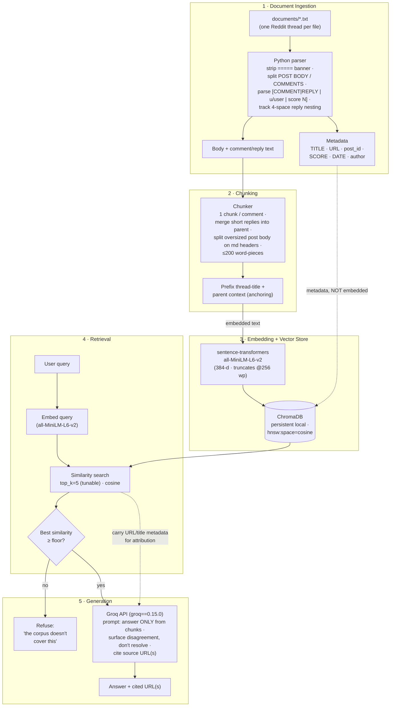

# Project 1 Planning: The Unofficial Guide

> Write this document before you write any pipeline code.
> Your spec and architecture diagram are what you'll use to direct AI tools (Claude, Copilot, etc.) to generate your implementation — the more specific they are, the more useful the generated code will be.
> Update the Retrieval Approach and Chunking Strategy sections if you change your approach during implementation.
> Update this file before starting any stretch features.

---

## Domain

<!-- What domain did you choose? Why is this knowledge valuable and hard to find through official channels? -->

**What SJSU students actually say about CS / Software Engineering professors and courses.** The corpus captures crowd-sourced, candid student experience from r/SJSU: which professors to take or avoid, how hard specific courses are (CS 46A/46B, 146, 147/149, 151, 157A), realistic workload and grading, course sequencing, and which classes best fill GE areas. This knowledge is valuable precisely because it is *absent from official channels*: the catalog and registrar list prerequisites and units but never say a course is "hard but curved" or that a named professor "writes his own RMP reviews"; advisors are cautious and won't name-and-shame instructors; and Rate My Professor entries are sparse, gamed, or deleted (one whole thread documents negative reviews being removed). Reddit is where the unfiltered, attributable signal lives.

In this project a **"document" = one Reddit thread** — the original post plus the comments we actually fetched for it — written to a single `documents/<post_id>.txt` file with a metadata header (title, full URL, date, score, fetched/substantive comment counts), the post body, and the comments delimited and indented to preserve parent→reply nesting.

---

## Documents

<!-- List your specific sources: URLs, subreddit names, forum threads, or file descriptions.
     Aim for at least 10 sources that together cover different subtopics or perspectives within your domain. -->

All sources are real r/SJSU threads collected via the PullPush.io Reddit archive (one thread = one `documents/<post_id>.txt`). 15 curated threads, each with ≥5 substantive (non-bot, non-deleted, non-noise) fetched comments, spanning courses, professors, difficulty, workload, and GE selection.

| # | Source (file) | Description | URL |
|---|---------------|-------------|-----|
| 1 | `kighem.txt` | "Spartan's Ultimate Guide, Part 2" — CS classes & professors to take vs avoid (Suneuy Kim, Patra, Kong Li, Olga Kovaleva), plus a math-minor path | https://www.reddit.com/r/SJSU/comments/kighem/the_spartans_ultimate_guide_to_sjsu_part_2/ |
| 2 | `2ljx6r.txt` | Adel Atta — collection of negative Rate My Professor reviews that were removed; professor-reputation case study | https://www.reddit.com/r/SJSU/comments/2ljx6r/adel_atta_negative_reviews_removed_from_rate_my/ |
| 3 | `2u15xl.txt` | CS majors rank the upper-division courses by difficulty (146/147/149/151; mentions Atta, Dr. Fai Yeung) | https://www.reddit.com/r/SJSU/comments/2u15xl/cs_majors_how_would_you_rank_the_upper_division/ |
| 4 | `3wjyr5.txt` | "CS 47 or CS 151?" — course-selection + workload advice (Patra, Kim, Yazdankhah) | https://www.reddit.com/r/SJSU/comments/3wjyr5/cs_47_or_cs_151/ |
| 5 | `123uh6b.txt` | Computer Science vs Software Engineering B.S. — program comparison and tradeoffs | https://www.reddit.com/r/SJSU/comments/123uh6b/computer_science_vs_software_engineering_bs/ |
| 6 | `3xmqve.txt` | Difference between CS 46B and CS 146 — content depth, projects, professors (Shaverdian, Mortezaie) | https://www.reddit.com/r/SJSU/comments/3xmqve/computer_science_difference_between_cs_46b_and_cs/ |
| 7 | `37amxl.txt` | Taking 4 CS major courses in one semester — workload reality (147/149 "hard but curved"; Mak for 149) | https://www.reddit.com/r/SJSU/comments/37amxl/comp_sci_majors_4_major_courses_in_one_semester/ |
| 8 | `btavob.txt` | CS 146 for a transfer student with C++/Python (Java prereq, CS 49J, prereq enforcement) | https://www.reddit.com/r/SJSU/comments/btavob/cs_transfer_from_c_school_about_cs_146/ |
| 9 | `94eap5.txt` | CS 157A (databases) with Ahmed Ezzat — survival tips, grading, comparison to Suneuy Kim | https://www.reddit.com/r/SJSU/comments/94eap5/i_am_taking_cs_157a_with_professor_ahmed_ezzat/ |
| 10 | `5rm577.txt` | Best CS electives / deep courses (CS 108 Game Design, CS 155 Algorithms, CS 185c) | https://www.reddit.com/r/SJSU/comments/5rm577/best_cs_electivesdeep_course/ |
| 11 | `1bwuij.txt` | Which CS/CmpE course to take — includes a blunt "DON'T TAKE 187 WITH GAO" warning | https://www.reddit.com/r/SJSU/comments/1bwuij/could_use_some_advice_on_which_course_to_take/ |
| 12 | `he58kf.txt` | Frosh fall-semester CS schedule advice (Math 42 workload, GE area sequencing) | https://www.reddit.com/r/SJSU/comments/he58kf/frosh_courses_for_this_fall_semestercs_major/ |
| 13 | `c81p6a.txt` | "Things I Wish Someone Told Me Freshman Year (Engineering)" — broad CS/eng advice (36 comments) | https://www.reddit.com/r/SJSU/comments/c81p6a/things_i_wish_someone_told_me_freshman_year/ |
| 14 | `2e4b40.txt` | New-student tips — courses, professors, study habits, workload | https://www.reddit.com/r/SJSU/comments/2e4b40/with_school_less_than_a_week_away_here_are_some/ |
| 15 | `nzwxu4.txt` | Best classes to fill GE areas (Professor Do for AAS33A/B, Chem 30A vs Chem 1A) — GE subtopic | https://www.reddit.com/r/SJSU/comments/nzwxu4/best_class_to_fulfill_d2_or_d3us123_and_best/ |

---

## Chunking Strategy

<!-- How will you split documents into chunks?
     State your chunk size (in tokens or characters), overlap size, and explain why those
     numbers fit the structure of your documents.
     A review-heavy corpus warrants different chunking than a long FAQ. -->

**Chunk size:** ~200 word-pieces maximum per chunk (hard ceiling below MiniLM's
256 word-piece silent-truncation limit, with the thread-title prefix counted
inside that budget). Most chunks land well under it — one comment is typically
40–120 words ≈ 60–170 word-pieces.

**Overlap:** None between sibling comments (each comment is a semantically
self-contained unit, so window overlap would only duplicate unrelated
opinions). The only deliberate redundancy is *vertical*: the thread-title
prefix and, for replies, the parent-comment context are re-attached to each
chunk (see Reasoning). The single case that overflows 200 word-pieces — a long
structured post body — is split on existing markdown headers with a one-line
header echo carried into the next chunk so a "Take!" / "Avoid" list never loses
its section label.

**Reasoning (chunk per comment, hybrid only for oversized post bodies):**

The corpus is *comment-structured threads*, not prose, so chunk boundaries
follow the document's own delimiters rather than a fixed character window. Each
`documents/<post_id>.txt` has a fixed `=====` banner header, a `--- POST BODY ---`
section, and a `--- COMMENTS ---` section whose units are marked
`[COMMENT | u/user | score N]` (top level) and `[REPLY | u/user | score N]`
(indented 4 spaces per nesting level). The parser strips the banner, routes
`TITLE / URL / post_id / SCORE / DATE` into Chroma **metadata** (never embedded),
and chunks only the post body and comment/reply bodies.

*Concrete measurement.* Comment length is **bimodal**. Substantive comments are
self-contained mid-length opinions: in `94eap5.txt` (CS 157A / Ezzat),
`u/sjsuthrowaway`'s comment ("The work won't be difficult... he likes to brag,
snapping at students... a cartoon character") is ~55 words; in `2u15xl.txt`
`u/vader32` rates seven courses in ~90 words. These map cleanly to one chunk
each — a **fixed window would slice mid-opinion** (e.g. cut "147 — Was pretty
easy but I took it with **Atta** (disclaimer)" away from the course it rates).
The other mode is **one-liner replies**: `1bwuij.txt` line 62 is the entire
high-value warning `"DONT TAKE 187 WITH GAO"` (5 words); `kighem.txt` has
`"🐐🐐🐐🐐thanks!!"` and `"Thanks for this!"`. So the strategy is:

1. **One chunk per top-level comment** (and per substantive standalone reply).
2. **Short-comment merge rule** — a reply below a minimum-content threshold
   (~15 word-pieces / a handful of words) is folded into its parent comment's
   chunk. This both drops pure noise ("thanks!!") and rescues high-value
   one-liners: `"DONT TAKE 187 WITH GAO"` merges up into `u/Riotblade`'s parent
   comment, which carries "CmpE187... J. Gao always teaches that course," so the
   warning keeps its course+professor anchor. This is the exact context-loss
   failure earmarked in the Evaluation Plan: `kighem.txt` lines 143–147, where
   the reply "his class is easier than most bc he is a good professor" names
   neither Fabio nor CS 174 — both live only in the parent comment.
3. **Question-context anchoring (per ADR-001).** Every chunk's embedded text is
   prefixed with the thread title (and, for a reply chunk, a short parent
   snippet), so a free-floating answer like "The work won't be difficult"
   (`94eap5.txt`) embeds *with* "CS 157A with professor Ahmed Ezzat" and never
   loses which professor/course it refers to.
4. **Hybrid only where the structure demands it.** The lone exception to
   per-comment chunking is an oversized post body: `kighem.txt`'s "Spartan's
   Ultimate Guide" body is ~1,300 words with markdown sections
   (`# Picking Your Classes`, `**AVOID, AVOID, AND AVOID**`, `**Take!**`,
   `# Electives To Take`). That blows past 200 word-pieces and is split on those
   existing headers, echoing the section label into each piece so the
   take/avoid professor lists stay labeled. These are *not generic defaults*:
   the size ceiling is driven by MiniLM (256), the boundaries by the corpus's
   own comment/reply/header structure, and the merge rule by the measured
   one-liner mode.

---

## Retrieval Approach

<!-- Which embedding model are you using (e.g., all-MiniLM-L6-v2 via sentence-transformers)?
     How many chunks will you retrieve per query (top-k)?
     If you were deploying this for real users and cost wasn't a constraint, what tradeoffs
     would you weigh in choosing a different embedding model — context length, multilingual
     support, accuracy on domain-specific text, latency? -->

**Embedding model:** `all-MiniLM-L6-v2` (via `sentence-transformers`). It maps text
to 384-dimensional vectors, runs fast on a CPU laptop (~5x faster than
`all-mpnet-base-v2`), and is small to download (~90 MB). At this scale — a few
hundred short, informal English chunks where the relevant passage usually contains
the professor's name or course code outright — a larger model like
`all-mpnet-base-v2` or `bge-small-en-v1.5` would retrieve the same passages while
costing more latency and disk for no measurable gain. MiniLM is also the canonical
sentence-transformers baseline, which keeps the pipeline reproducible and easy to
grade. Embeddings are stored in a persistent ChromaDB collection created with
`hnsw:space="cosine"` (Chroma's default is L2 and the space cannot be changed after
creation), so they are computed once and reused across runs, with source thread id,
title, and URL kept as metadata for attribution. A minimum-similarity floor gates
retrieval: when even the best match falls below it, the system answers "the corpus
doesn't cover this" instead of summarizing the k least-irrelevant chunks. The floor
value is calibrated empirically at Milestone 4 against the eval questions plus
deliberate out-of-corpus probes.

**Top-k:** 5, exposed as a tunable parameter (default 5). This corpus is threaded
discussion: a good answer to a question like "Should I take Professor Ezzat?"
synthesizes several distinct comments rather than one fact. k=3 risks surfacing a
single hot take as if it were consensus; k=5 reliably gathers a representative spread
of perspectives (often across multiple threads) while keeping the generation context
focused and grounded. k stays a one-line constant so it can be re-tuned during
evaluation.

**Production tradeoff reflection:** With real users and no cost constraint, I would
weigh factors that don't matter at a few-hundred-chunk course scale. I'd test a
retrieval-tuned or larger model (`bge-small-en-v1.5`, `bge-large`, `all-mpnet-base-v2`)
or a hosted embedding API (OpenAI `text-embedding-3-large`, Cohere `embed-v3`) for
higher accuracy on domain-specific text — especially professor nicknames, course codes
like "CS 157A", and sentiment-loaded slang ("hard but curved", "RUN") that
general-purpose embeddings can under-weight. I'd want longer context length if chunks
grew (MiniLM truncates at 256 word-pieces; mpnet allows 384, bge-small 512). For a
diverse student body I'd consider multilingual support (`bge-m3`,
`paraphrase-multilingual-MiniLM`) — MiniLM is English-only, and our corpus already
includes non-native-speaker threads. I'd weigh hosted APIs (better accuracy, zero local
compute, but per-call cost, network latency, and sending data off-machine) against
local models (free, private, offline, but bounded by laptop CPU). At production scale
I'd also move from brute-force search to an ANN index (FAISS / a managed vector DB) and
likely add a reranker — all unjustified here, where exact search over a few hundred
vectors is instant.

---

## Evaluation Plan

<!-- List your 5 test questions with their expected correct answers.
     Questions should be specific enough that you can judge whether the system's response
     is right or wrong. "What are good dining halls?" is too vague.
     "What do students say about wait times at [dining hall name] during lunch?" is testable. -->

**DRAFT — to be finalized in Milestone 2.** All 6 candidates below passed a corpus coverage check: for each question, grep across `documents/*.txt` confirmed ≥2 distinct supporting passages (supporting files noted per row).

| # | Question | Expected answer |
|---|----------|-----------------|
| 1 | What do students say about Professor Adel Atta? | Strongly negative: students warn to "really think twice" before registering for his classes and document negative Rate My Professor reviews being removed; a CS 147 student adds "was pretty easy but I took it with Atta (disclaimer)". (`2ljx6r.txt`, `2u15xl.txt`) |
| 2 | According to students, how does CS 146 differ from CS 46B? | CS 146 is "more on the science side": more math/theory, more data structures, and a much harder textbook (CLRS); content overlaps 46B but goes deeper. (`3xmqve.txt`, `btavob.txt`) |
| 3 | Which upper-division CS courses do students rank as the hardest? | Students rank the upper-division set (146/147/149/151) with CS 146 and CS 147/149 discussed among the hardest — "hard but curved" — with instructor context (Yeung, Atta, Mak). (`2u15xl.txt`, `37amxl.txt`) |
| 4 | What do students say about taking CS 157A with Professor Ezzat? | Mixed-to-negative: the OP reports "most people I got to ask weren't positive about him"; commenters give survival tips on his homework, tests, and grading, and compare him to Suneuy Kim. (`94eap5.txt`, `2u15xl.txt`) |
| 5 | Which professors or courses do students explicitly say to avoid? | "DONT TAKE 187 WITH GAO" (CmpE 187); warnings about Adel Atta; the Spartan's Guide lists CS professors to take vs avoid. (`1bwuij.txt`, `2ljx6r.txt`, `kighem.txt`) |
| 6 | What GE classes do students recommend as easy or worthwhile? | AAS 33A/B with Professor Do ("it was easy... do not read his RMP reviews"), AMS-1A/1B (knocks out many areas at once), and Chem 30A over Chem 1A ("real easy, half is high-school review"). (`nzwxu4.txt`) |

**Hard-question earmark (for M2):** the corpus contains nested-reply context-loss cases — e.g. in `kighem.txt` a reply says "his class is easier than most bc he is a good professor" while the professor is named only in the parent comment. One of the five final questions will be designated around this failure mode in Milestone 2.

---

## Anticipated Challenges

<!-- What could go wrong? Name at least two specific risks with reasoning.
     Consider: noisy or inconsistent documents, missing source attribution, off-topic
     retrieval, chunks that split key information across boundaries. -->

1. **Threaded Q&A splits the question from its answer.**
   In our corpus a "document" is a Reddit thread where comments answer the *post's*
   question (e.g. in `94eap5.txt` the post asks whether Professor Ezzat is an easy
   grader, and the answer "The work won't be difficult so you shouldn't have any
   trouble passing" appears in a separate, later comment). If we chunk per-comment
   or by fixed windows, a retrieved answer chunk loses the professor/course it
   refers to, so the generator either hallucinates the subject or answers about the
   wrong professor. Mitigation: prepend the thread title (and a short statement of
   the post's question) to every chunk before embedding, so each chunk is
   self-describing, and lift `post_id`/`URL`/`title` into ChromaDB metadata for
   attribution.

2. **Shared opinion vocabulary causes off-topic and over-confident retrieval, and
   out-of-corpus queries risk hallucination.**
   Every thread uses the same words — "professor," "class," "easy," "hard,"
   "workload" — so at top_k=5 a query like "easy CS class" can pull chunks from
   unrelated threads that merely share that vocabulary, and threads openly
   contradict each other (151 is called "fairly easy" in `2u15xl.txt` while
   difficulty is the whole debate). Worse, ChromaDB always returns k results even
   for a professor/course not in the corpus, so without a relevance gate the system
   will confidently summarize the 5 least-irrelevant chunks. Mitigation: create the
   collection with `hnsw:space="cosine"`, apply a minimum-similarity threshold below
   which the system answers "the corpus doesn't cover this," and prompt the
   generator to surface disagreement rather than pick one side.

3. **Metadata banners and trivial comments pollute the index.**
   Each file opens with a `=====` banner and `TITLE/URL/SCORE/...` header and uses
   `[COMMENT | u/user | score N]` delimiters, and the corpus contains very short
   low-signal comments ("Thanks for this!") alongside very short high-value ones
   ("DONT TAKE 187 WITH GAO"). Naive chunking embeds URLs, scores, and usernames as
   if they were content and gives equal index weight to "Thanks for this!".
   Mitigation: parse the structured format — strip the banner and delimiters, route
   header fields to metadata, chunk only post body + comment text — and apply a
   minimum-content rule at chunk time, merging very short replies into their parent
   comment so high-value short warnings keep their course/professor context.

---

## Architecture

<!-- Draw a diagram of your pipeline showing the five stages:
     Document Ingestion → Chunking → Embedding + Vector Store → Retrieval → Generation
     Label each stage with the tool or library you're using.
     You can use ASCII art, a Mermaid diagram, or embed a sketch as an image.
     You'll use this diagram as context when prompting AI tools to implement each stage. -->

Stage-to-tool mapping: **(1)** custom Python parser for the `documents/*.txt`
format; **(2)** custom comment-aware chunker (Chunking Strategy above);
**(3)** `sentence-transformers` / `all-MiniLM-L6-v2` → ChromaDB persistent
collection created with `hnsw:space="cosine"`; **(4)** ChromaDB cosine
similarity at `top_k=5` with a minimum-similarity **refusal floor** as the
decision point; **(5)** Groq API for generation. Header fields flow as
**metadata only** (dashed lines) and are reattached at retrieval so every
answer can cite its source URL — they are never embedded.

---

## AI Tool Plan

<!-- For each part of the pipeline below, describe:
     - Which AI tool you plan to use (Claude, Copilot, ChatGPT, etc.)
     - What you'll give it as input (which sections of this planning.md, which requirements)
     - What you expect it to produce
     - How you'll verify the output matches your spec

     "I'll use AI to help me code" is not a plan.
     "I'll give Claude my Chunking Strategy section and ask it to implement chunk_text()
     with my specified chunk size and overlap" is a plan. -->

**Milestone 3 — Ingestion and chunking:**
- **Tool:** Claude (Claude Code) for the parser + chunker; Copilot for
  inline test scaffolding.
- **Input:** the **Chunking Strategy** and **Architecture** sections above, the
  fixed `=====`/`--- POST BODY ---`/`--- COMMENTS ---` banner and
  `[COMMENT|REPLY | u/user | score N]` delimiter spec, ADR-001 + addendum
  (metadata routing, title prefix, short-comment merge, ≤200 word-piece budget),
  and 2–3 real files (`kighem.txt` for the oversized-body + header-split case,
  `1bwuij.txt` for the short-reply merge case, `94eap5.txt` for nested replies).
- **Expected output:** `parse_document()` returning (metadata dict, body,
  nested comments) and `chunk_document()` returning chunks each carrying
  `{text_with_title_prefix, metadata{TITLE,URL,post_id,author,score}}`.
- **Verification (concrete):** (a) on `1bwuij.txt`, assert the
  `"DONT TAKE 187 WITH GAO"` reply was **merged into** the CmpE187/Gao parent
  chunk, not emitted alone; (b) on `kighem.txt`, assert the ~1,300-word body
  produced multiple chunks each ≤200 word-pieces and each retaining its section
  label; (c) inspect a sample chunk's title prefix is present and `TITLE/URL`
  are in metadata, **not** in embedded text; (d) print total chunk count and
  spot-check that no chunk exceeds the word-piece budget; (e) confirm
  `kighem` lines 143–147 reply chunk carries Fabio/CS-174 parent context.

**Milestone 4 — Embedding and retrieval:**
- **Tool:** Claude for the embed/index/query module; Claude to review that the
  collection is created with `hnsw:space="cosine"` (not the L2 default).
- **Input:** the **Retrieval Approach** + **Architecture** sections, ADR-001
  addendum (cosine space, refusal floor), the M3 chunk objects, and the
  **Evaluation Plan**'s 6 questions with their supporting files.
- **Expected output:** an indexer that embeds prefixed chunk text via
  `all-MiniLM-L6-v2` and upserts to the persistent ChromaDB collection with
  metadata; a `retrieve(query, top_k=5)` returning chunks + cosine scores; a
  similarity-floor gate.
- **Verification (concrete):** (a) for **each eval question #1–#6**, the named
  supporting passage surfaces in `top_k=5` — e.g. Q4 (Ezzat) returns the
  `94eap5.txt` "most people... weren't positive" / "work won't be difficult"
  chunks; Q5 (avoid) returns the merged `1bwuij.txt` Gao chunk and the
  `2ljx6r.txt` Atta chunk; (b) assert `collection.metadata` reports cosine
  space; (c) an out-of-corpus probe (e.g. "Professor Smith CS 999") scores
  **below** the floor and triggers refusal; (d) calibrate the floor so all 6
  in-corpus questions pass while the probe is rejected.

**Milestone 5 — Generation and interface:**
- **Tool:** Claude for the Groq prompt + interface (Gradio or Streamlit, per
  `requirements.txt` options); Claude to red-team the prompt for
  contradiction-surfacing and refusal behavior.
- **Input:** the **Architecture** stage 5 spec, ADR-001 addendum (refusal
  floor, cite URLs), the **Anticipated Challenges** contradiction policy
  (surface disagreement, don't resolve), and M4's retrieved chunks + metadata.
- **Expected output:** a generation function that passes the k chunks + their
  source URLs to the Groq LLM with a prompt that (i) answers only from
  retrieved chunks, (ii) surfaces disagreement, (iii) cites URL(s), and (iv)
  defers to refusal when the floor gate fired; plus a minimal query UI.
- **Verification (concrete):** (a) spot-check ≥3 answers — each cited URL's file
  actually contains the claim (e.g. Q1 Atta answer cites `2ljx6r.txt`'s URL and
  that thread documents the removed reviews); (b) a question with conflicting
  evidence (e.g. CS 146 difficulty: `2u15xl.txt` "tough" vs "146 got easier...
  Taylor didn't teach it") yields an answer that **reports both** rather than
  picking one; (c) the out-of-corpus probe from M4 returns the refusal string,
  not a fabricated professor summary.
